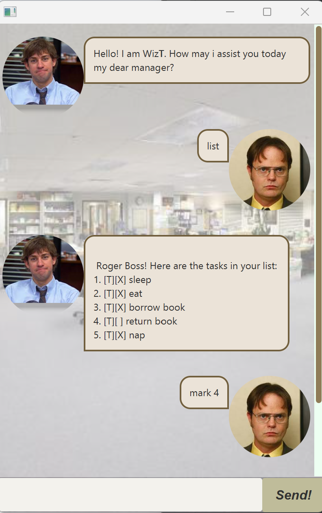

# WizT User Guide


## Screenshot


## Introduction
WizT is an office-themed task management application that allows user to track their current tasks efficiently

## View Tasks
User can view all tasks in the task list

* **Format:** `list`

## Adding Todo
User can add Todo tasks to keep efficiently track of the tasks

* **Format:** `todo <TASK>`

* **Example:** `todo run`


## Adding deadlines
User can add a Deadline task for tracking. The task will be saved to a text file and will be displayed to user when prompted

* **Format:** `deadline <TASK> /by [dd/MM/yyyy HHmm]`

* **Example:** `deadline return book /by 19/02/2019 1800`

The application will show the task added and the amount of task in the current list
```
Got it Boss! I've added this task:
[D][] return book (by: 19 Feb 2019 18:00)
Now you have 6 tasks in the list
```

## Adding Event
User can add a Event task for tracking. The task will be saved to a text file and will be displayed to user when prompted

* **Format:** `event <TASK> /from [dd/MM/yyyy HHmm] /to [dd/MM/yyyy HHmm] `

* **Example:** `event project meeting /from 19/02/2019 1800 /to 21/02/2019 1800`

The application will show the task added and the amount of task in the current list
```
Got it Boss! I've added this task:
[E][] project meeting (from: 19 Feb 2019 18:00 to 21 Feb 2019 18:00)
Now you have 6 tasks in the list
```


## Update
User can update a task that is already in the list, thus it will be more efficient as user do not need to find and delete the task to update it

* **Format:** `update <TASK NO.> <UPDATED TASK>`
* **Example:** `update 2 run`

This will update and rename the 2nd task in the list to run


## Find
User can search through the list to find a task based on the given keyword.

* **Format:** `find <TASK>`
* **Example:**  `find run`

## Delete
User can delete a corresponding task by providing the task number

* **Format:** `delete <TASK NO.>`
* **Example:**  `delete 2`

## Mark
User can mark a corresponding task as completed by providing the task number

* **Format:** `mark <TASK NO.>`
* **Example:**  `mark 2`

## Unmark
User can unmark a corresponding task as not completed by providing the task number

* **Format:** `unmark <TASK NO.>`
* **Example:**  `unmark 2`


## Help
User can see a list of available command through the `help` command

* **Format:** `help`

## Bye
User can exit the program with the `bye` command in which the application will automatically exit after 3 seconds

**Note: User will need to enter the `bye` command in order for the changes to be saved to the text file!**

* **Format:** `bye`