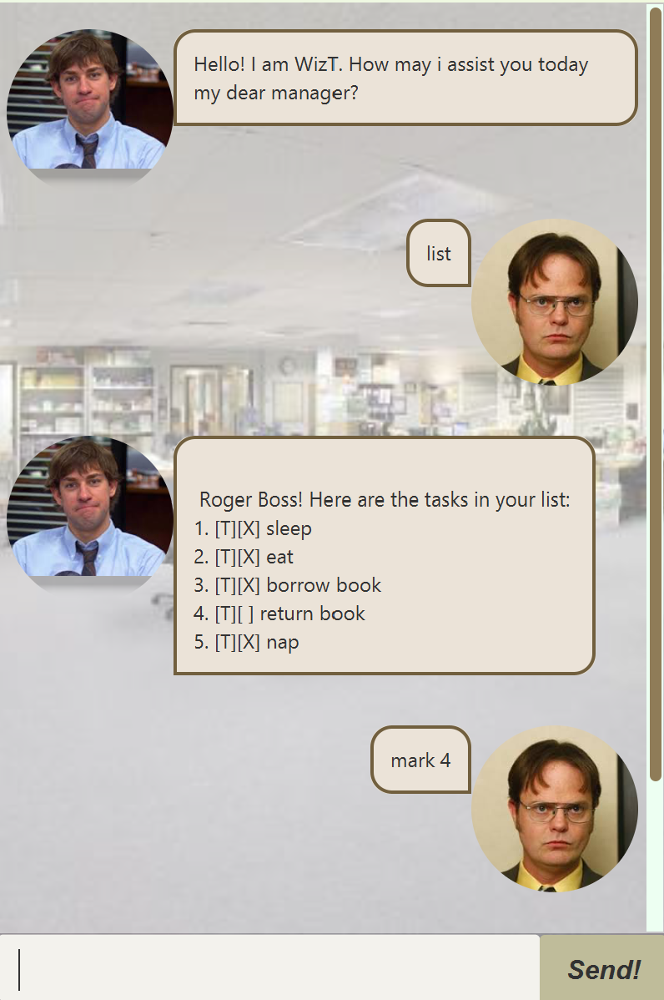

# wizt.ui.WizT User Guide


## Screenshot


## Introduction
WizT is an office-themed task management application that allows user to track their current tasks efficiently

## Adding deadlines
User can add a task and its deadline for tracking. The task will be saved to a text file and will be displayed to user when prompted

Example `deadline return book /by 19/02/2019 1800`

The application will show the task added and the amount of task in the current list
```
Got it Boss! I've added this task:
[D][] return book (by: 19 Feb 2019 18:00)
Now you have 6 tasks in the list
```

## Update
User can update a task that is already in the list, thus it will be more efficient as user do not need to find and delete the task to update it
Example `update 2 run`
This will update and rename the 2nd task of in the list to run 


## Find
User can search through the list to find a task based on the given keyword. 
Example `find run`